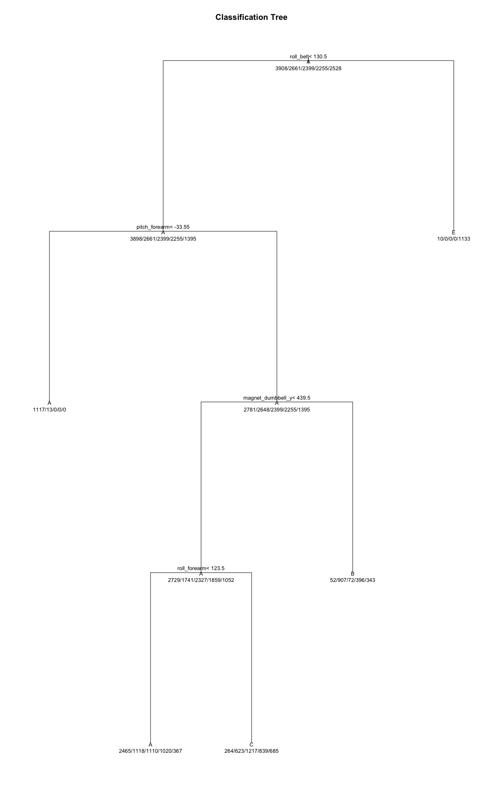
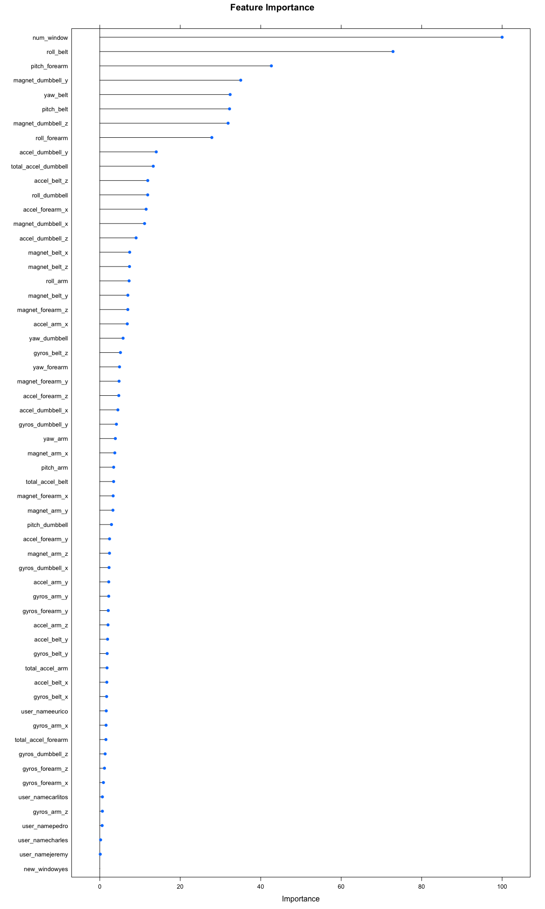
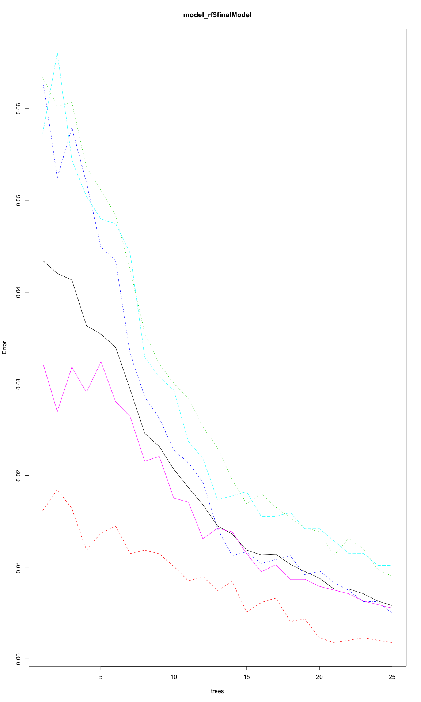

### Overview

In this project, the goal is to use data from accelerometers on the
belt, forearm, arm, and dumbell of 6 participants. They were asked to
perform barbell lifts correctly and incorrectly in 5 different ways. The
5 ways are described as Class A,B,C,D and E, the meaning of each class
is below:

Class A means exactly according to the specification. Class B means
throwing the elbows to the front. Class C means lifting the dumbbell
only halfway. Class D means lowering the dumbbell only halfway. Class E
throwing the hips to the front.

We would build machine learning models to quantify how well they do it.

### Load Data

``` r
raw_train <- read.csv('~/Desktop/pml-training.csv', row.names = 'X')
raw_test  <- read.csv('~/Desktop/pml-testing.csv', row.names = 'X')


dim(raw_train)
```

    ## [1] 19622   159

``` r
dim(raw_test)
```

    ## [1]  20 159

### Data Processing

Given there’re 100+ features to start with, it would be easier if we can
throw out some “undefined” variables that majority of the records are
NA’s. For better prediction and avoid incorrect imputation, I’ll remove
the variables that are all NAs in test set.

``` r
# Columns that all values are NA.
all_na = function(x) all(is.na(raw_test[x]))
all_na_v = Vectorize(all_na)(colnames(raw_test))
columns_all_na = colnames(raw_test)[all_na_v]
print ("The following features are removed because all the values in Test Dataset are NAs...")
```

    ## [1] "The following features are removed because all the values in Test Dataset are NAs..."

``` r
print (columns_all_na)
```

    ##   [1] "kurtosis_roll_belt"       "kurtosis_picth_belt"     
    ##   [3] "kurtosis_yaw_belt"        "skewness_roll_belt"      
    ##   [5] "skewness_roll_belt.1"     "skewness_yaw_belt"       
    ##   [7] "max_roll_belt"            "max_picth_belt"          
    ##   [9] "max_yaw_belt"             "min_roll_belt"           
    ##  [11] "min_pitch_belt"           "min_yaw_belt"            
    ##  [13] "amplitude_roll_belt"      "amplitude_pitch_belt"    
    ##  [15] "amplitude_yaw_belt"       "var_total_accel_belt"    
    ##  [17] "avg_roll_belt"            "stddev_roll_belt"        
    ##  [19] "var_roll_belt"            "avg_pitch_belt"          
    ##  [21] "stddev_pitch_belt"        "var_pitch_belt"          
    ##  [23] "avg_yaw_belt"             "stddev_yaw_belt"         
    ##  [25] "var_yaw_belt"             "var_accel_arm"           
    ##  [27] "avg_roll_arm"             "stddev_roll_arm"         
    ##  [29] "var_roll_arm"             "avg_pitch_arm"           
    ##  [31] "stddev_pitch_arm"         "var_pitch_arm"           
    ##  [33] "avg_yaw_arm"              "stddev_yaw_arm"          
    ##  [35] "var_yaw_arm"              "kurtosis_roll_arm"       
    ##  [37] "kurtosis_picth_arm"       "kurtosis_yaw_arm"        
    ##  [39] "skewness_roll_arm"        "skewness_pitch_arm"      
    ##  [41] "skewness_yaw_arm"         "max_roll_arm"            
    ##  [43] "max_picth_arm"            "max_yaw_arm"             
    ##  [45] "min_roll_arm"             "min_pitch_arm"           
    ##  [47] "min_yaw_arm"              "amplitude_roll_arm"      
    ##  [49] "amplitude_pitch_arm"      "amplitude_yaw_arm"       
    ##  [51] "kurtosis_roll_dumbbell"   "kurtosis_picth_dumbbell" 
    ##  [53] "kurtosis_yaw_dumbbell"    "skewness_roll_dumbbell"  
    ##  [55] "skewness_pitch_dumbbell"  "skewness_yaw_dumbbell"   
    ##  [57] "max_roll_dumbbell"        "max_picth_dumbbell"      
    ##  [59] "max_yaw_dumbbell"         "min_roll_dumbbell"       
    ##  [61] "min_pitch_dumbbell"       "min_yaw_dumbbell"        
    ##  [63] "amplitude_roll_dumbbell"  "amplitude_pitch_dumbbell"
    ##  [65] "amplitude_yaw_dumbbell"   "var_accel_dumbbell"      
    ##  [67] "avg_roll_dumbbell"        "stddev_roll_dumbbell"    
    ##  [69] "var_roll_dumbbell"        "avg_pitch_dumbbell"      
    ##  [71] "stddev_pitch_dumbbell"    "var_pitch_dumbbell"      
    ##  [73] "avg_yaw_dumbbell"         "stddev_yaw_dumbbell"     
    ##  [75] "var_yaw_dumbbell"         "kurtosis_roll_forearm"   
    ##  [77] "kurtosis_picth_forearm"   "kurtosis_yaw_forearm"    
    ##  [79] "skewness_roll_forearm"    "skewness_pitch_forearm"  
    ##  [81] "skewness_yaw_forearm"     "max_roll_forearm"        
    ##  [83] "max_picth_forearm"        "max_yaw_forearm"         
    ##  [85] "min_roll_forearm"         "min_pitch_forearm"       
    ##  [87] "min_yaw_forearm"          "amplitude_roll_forearm"  
    ##  [89] "amplitude_pitch_forearm"  "amplitude_yaw_forearm"   
    ##  [91] "var_accel_forearm"        "avg_roll_forearm"        
    ##  [93] "stddev_roll_forearm"      "var_roll_forearm"        
    ##  [95] "avg_pitch_forearm"        "stddev_pitch_forearm"    
    ##  [97] "var_pitch_forearm"        "avg_yaw_forearm"         
    ##  [99] "stddev_yaw_forearm"       "var_yaw_forearm"

``` r
filter_column_names = colnames(raw_test)[!all_na_v]
filter_train <- raw_train[, !colnames(raw_train) %in% columns_all_na]
filter_test <- raw_test[,filter_column_names]

filter_train[!sapply(filter_train, is.factor)] = sapply(filter_train[!sapply(filter_train, is.factor)], as.numeric)
filter_test[!sapply(filter_test, is.factor)] = sapply(filter_test[!sapply(filter_test, is.factor)], as.numeric)

# Remove timestamp columns: raw_timestamp_part_1, raw_timestamp_part_2, cvtd_timestamp
filter_train = filter_train[, !colnames(filter_train) %in% c("raw_timestamp_part_1", "raw_timestamp_part_2", "cvtd_timestamp")]
filter_test = filter_test[, !colnames(filter_test) %in% c("raw_timestamp_part_1", "raw_timestamp_part_2", "cvtd_timestamp")]


summary(filter_train)
```

    ##     user_name    new_window    num_window      roll_belt     
    ##  adelmo  :3892   no :19216   Min.   :  1.0   Min.   :-28.90  
    ##  carlitos:3112   yes:  406   1st Qu.:222.0   1st Qu.:  1.10  
    ##  charles :3536               Median :424.0   Median :113.00  
    ##  eurico  :3070               Mean   :430.6   Mean   : 64.41  
    ##  jeremy  :3402               3rd Qu.:644.0   3rd Qu.:123.00  
    ##  pedro   :2610               Max.   :864.0   Max.   :162.00  
    ##    pitch_belt          yaw_belt       total_accel_belt  gyros_belt_x      
    ##  Min.   :-55.8000   Min.   :-180.00   Min.   : 0.00    Min.   :-1.040000  
    ##  1st Qu.:  1.7600   1st Qu.: -88.30   1st Qu.: 3.00    1st Qu.:-0.030000  
    ##  Median :  5.2800   Median : -13.00   Median :17.00    Median : 0.030000  
    ##  Mean   :  0.3053   Mean   : -11.21   Mean   :11.31    Mean   :-0.005592  
    ##  3rd Qu.: 14.9000   3rd Qu.:  12.90   3rd Qu.:18.00    3rd Qu.: 0.110000  
    ##  Max.   : 60.3000   Max.   : 179.00   Max.   :29.00    Max.   : 2.220000  
    ##   gyros_belt_y       gyros_belt_z      accel_belt_x       accel_belt_y   
    ##  Min.   :-0.64000   Min.   :-1.4600   Min.   :-120.000   Min.   :-69.00  
    ##  1st Qu.: 0.00000   1st Qu.:-0.2000   1st Qu.: -21.000   1st Qu.:  3.00  
    ##  Median : 0.02000   Median :-0.1000   Median : -15.000   Median : 35.00  
    ##  Mean   : 0.03959   Mean   :-0.1305   Mean   :  -5.595   Mean   : 30.15  
    ##  3rd Qu.: 0.11000   3rd Qu.:-0.0200   3rd Qu.:  -5.000   3rd Qu.: 61.00  
    ##  Max.   : 0.64000   Max.   : 1.6200   Max.   :  85.000   Max.   :164.00  
    ##   accel_belt_z     magnet_belt_x   magnet_belt_y   magnet_belt_z   
    ##  Min.   :-275.00   Min.   :-52.0   Min.   :354.0   Min.   :-623.0  
    ##  1st Qu.:-162.00   1st Qu.:  9.0   1st Qu.:581.0   1st Qu.:-375.0  
    ##  Median :-152.00   Median : 35.0   Median :601.0   Median :-320.0  
    ##  Mean   : -72.59   Mean   : 55.6   Mean   :593.7   Mean   :-345.5  
    ##  3rd Qu.:  27.00   3rd Qu.: 59.0   3rd Qu.:610.0   3rd Qu.:-306.0  
    ##  Max.   : 105.00   Max.   :485.0   Max.   :673.0   Max.   : 293.0  
    ##     roll_arm         pitch_arm          yaw_arm          total_accel_arm
    ##  Min.   :-180.00   Min.   :-88.800   Min.   :-180.0000   Min.   : 1.00  
    ##  1st Qu.: -31.77   1st Qu.:-25.900   1st Qu.: -43.1000   1st Qu.:17.00  
    ##  Median :   0.00   Median :  0.000   Median :   0.0000   Median :27.00  
    ##  Mean   :  17.83   Mean   : -4.612   Mean   :  -0.6188   Mean   :25.51  
    ##  3rd Qu.:  77.30   3rd Qu.: 11.200   3rd Qu.:  45.8750   3rd Qu.:33.00  
    ##  Max.   : 180.00   Max.   : 88.500   Max.   : 180.0000   Max.   :66.00  
    ##   gyros_arm_x        gyros_arm_y       gyros_arm_z       accel_arm_x     
    ##  Min.   :-6.37000   Min.   :-3.4400   Min.   :-2.3300   Min.   :-404.00  
    ##  1st Qu.:-1.33000   1st Qu.:-0.8000   1st Qu.:-0.0700   1st Qu.:-242.00  
    ##  Median : 0.08000   Median :-0.2400   Median : 0.2300   Median : -44.00  
    ##  Mean   : 0.04277   Mean   :-0.2571   Mean   : 0.2695   Mean   : -60.24  
    ##  3rd Qu.: 1.57000   3rd Qu.: 0.1400   3rd Qu.: 0.7200   3rd Qu.:  84.00  
    ##  Max.   : 4.87000   Max.   : 2.8400   Max.   : 3.0200   Max.   : 437.00  
    ##   accel_arm_y      accel_arm_z       magnet_arm_x     magnet_arm_y   
    ##  Min.   :-318.0   Min.   :-636.00   Min.   :-584.0   Min.   :-392.0  
    ##  1st Qu.: -54.0   1st Qu.:-143.00   1st Qu.:-300.0   1st Qu.:  -9.0  
    ##  Median :  14.0   Median : -47.00   Median : 289.0   Median : 202.0  
    ##  Mean   :  32.6   Mean   : -71.25   Mean   : 191.7   Mean   : 156.6  
    ##  3rd Qu.: 139.0   3rd Qu.:  23.00   3rd Qu.: 637.0   3rd Qu.: 323.0  
    ##  Max.   : 308.0   Max.   : 292.00   Max.   : 782.0   Max.   : 583.0  
    ##   magnet_arm_z    roll_dumbbell     pitch_dumbbell     yaw_dumbbell     
    ##  Min.   :-597.0   Min.   :-153.71   Min.   :-149.59   Min.   :-150.871  
    ##  1st Qu.: 131.2   1st Qu.: -18.49   1st Qu.: -40.89   1st Qu.: -77.644  
    ##  Median : 444.0   Median :  48.17   Median : -20.96   Median :  -3.324  
    ##  Mean   : 306.5   Mean   :  23.84   Mean   : -10.78   Mean   :   1.674  
    ##  3rd Qu.: 545.0   3rd Qu.:  67.61   3rd Qu.:  17.50   3rd Qu.:  79.643  
    ##  Max.   : 694.0   Max.   : 153.55   Max.   : 149.40   Max.   : 154.952  
    ##  total_accel_dumbbell gyros_dumbbell_x    gyros_dumbbell_y  
    ##  Min.   : 0.00        Min.   :-204.0000   Min.   :-2.10000  
    ##  1st Qu.: 4.00        1st Qu.:  -0.0300   1st Qu.:-0.14000  
    ##  Median :10.00        Median :   0.1300   Median : 0.03000  
    ##  Mean   :13.72        Mean   :   0.1611   Mean   : 0.04606  
    ##  3rd Qu.:19.00        3rd Qu.:   0.3500   3rd Qu.: 0.21000  
    ##  Max.   :58.00        Max.   :   2.2200   Max.   :52.00000  
    ##  gyros_dumbbell_z  accel_dumbbell_x  accel_dumbbell_y  accel_dumbbell_z 
    ##  Min.   : -2.380   Min.   :-419.00   Min.   :-189.00   Min.   :-334.00  
    ##  1st Qu.: -0.310   1st Qu.: -50.00   1st Qu.:  -8.00   1st Qu.:-142.00  
    ##  Median : -0.130   Median :  -8.00   Median :  41.50   Median :  -1.00  
    ##  Mean   : -0.129   Mean   : -28.62   Mean   :  52.63   Mean   : -38.32  
    ##  3rd Qu.:  0.030   3rd Qu.:  11.00   3rd Qu.: 111.00   3rd Qu.:  38.00  
    ##  Max.   :317.000   Max.   : 235.00   Max.   : 315.00   Max.   : 318.00  
    ##  magnet_dumbbell_x magnet_dumbbell_y magnet_dumbbell_z  roll_forearm      
    ##  Min.   :-643.0    Min.   :-3600     Min.   :-262.00   Min.   :-180.0000  
    ##  1st Qu.:-535.0    1st Qu.:  231     1st Qu.: -45.00   1st Qu.:  -0.7375  
    ##  Median :-479.0    Median :  311     Median :  13.00   Median :  21.7000  
    ##  Mean   :-328.5    Mean   :  221     Mean   :  46.05   Mean   :  33.8265  
    ##  3rd Qu.:-304.0    3rd Qu.:  390     3rd Qu.:  95.00   3rd Qu.: 140.0000  
    ##  Max.   : 592.0    Max.   :  633     Max.   : 452.00   Max.   : 180.0000  
    ##  pitch_forearm     yaw_forearm      total_accel_forearm gyros_forearm_x  
    ##  Min.   :-72.50   Min.   :-180.00   Min.   :  0.00      Min.   :-22.000  
    ##  1st Qu.:  0.00   1st Qu.: -68.60   1st Qu.: 29.00      1st Qu.: -0.220  
    ##  Median :  9.24   Median :   0.00   Median : 36.00      Median :  0.050  
    ##  Mean   : 10.71   Mean   :  19.21   Mean   : 34.72      Mean   :  0.158  
    ##  3rd Qu.: 28.40   3rd Qu.: 110.00   3rd Qu.: 41.00      3rd Qu.:  0.560  
    ##  Max.   : 89.80   Max.   : 180.00   Max.   :108.00      Max.   :  3.970  
    ##  gyros_forearm_y     gyros_forearm_z    accel_forearm_x   accel_forearm_y 
    ##  Min.   : -7.02000   Min.   : -8.0900   Min.   :-498.00   Min.   :-632.0  
    ##  1st Qu.: -1.46000   1st Qu.: -0.1800   1st Qu.:-178.00   1st Qu.:  57.0  
    ##  Median :  0.03000   Median :  0.0800   Median : -57.00   Median : 201.0  
    ##  Mean   :  0.07517   Mean   :  0.1512   Mean   : -61.65   Mean   : 163.7  
    ##  3rd Qu.:  1.62000   3rd Qu.:  0.4900   3rd Qu.:  76.00   3rd Qu.: 312.0  
    ##  Max.   :311.00000   Max.   :231.0000   Max.   : 477.00   Max.   : 923.0  
    ##  accel_forearm_z   magnet_forearm_x  magnet_forearm_y magnet_forearm_z
    ##  Min.   :-446.00   Min.   :-1280.0   Min.   :-896.0   Min.   :-973.0  
    ##  1st Qu.:-182.00   1st Qu.: -616.0   1st Qu.:   2.0   1st Qu.: 191.0  
    ##  Median : -39.00   Median : -378.0   Median : 591.0   Median : 511.0  
    ##  Mean   : -55.29   Mean   : -312.6   Mean   : 380.1   Mean   : 393.6  
    ##  3rd Qu.:  26.00   3rd Qu.:  -73.0   3rd Qu.: 737.0   3rd Qu.: 653.0  
    ##  Max.   : 291.00   Max.   :  672.0   Max.   :1480.0   Max.   :1090.0  
    ##  classe  
    ##  A:5580  
    ##  B:3797  
    ##  C:3422  
    ##  D:3216  
    ##  E:3607  
    ## 

### Construct Training Set and Validation Dataset

Given the dataset contains 6 users’ activities, we would like to sample
our training set and validation set with equal proportion, so that a
70/30 split on training data and validation dataset will have training
data with 70% records for user adelmo, 70% records for user charles and
so forth, meanwhile having validation data with 30% records for each
user.

``` r
library(caret)
```

    ## Loading required package: lattice

    ## Loading required package: ggplot2

``` r
set.seed(110322)
training = data.frame()
validation = data.frame()
for (user in unique(filter_train$user_name)) {
  temp_filter_train = filter_train[filter_train$user_name == user,]
  inTrain = createDataPartition(y=temp_filter_train$classe, p=0.7, list=FALSE)
  
  training = rbind(training, temp_filter_train[inTrain,])
  validation = rbind(validation, temp_filter_train[-inTrain,])

}
```

Then, We would like to use 10-fold cross validation. Caret has a
function called trainControl to define such scheme.

``` r
library(caret)
set.seed(110322)
train_control = trainControl(method="cv", number = 5)
```

### Model Construction

We start with Multinomial Logistic Regression.

``` r
model_lr = train(classe ~ ., data=training, trControl=train_control, method="multinom")
```

    ## # weights:  305 (240 variable)
    ## initial  value 17703.817037 
    ## iter  10 value 13876.383186
    ## iter  20 value 12326.229738
    ## iter  30 value 11499.840977
    ## iter  40 value 11005.803410
    ## iter  50 value 10658.152726
    ## iter  60 value 10413.026565
    ## iter  70 value 10268.339375
    ## iter  80 value 10175.089955
    ## iter  90 value 10110.490342
    ## iter 100 value 10054.019201
    ## final  value 10054.019201 
    ## stopped after 100 iterations
    ## # weights:  305 (240 variable)
    ## initial  value 17703.817037 
    ## iter  10 value 13876.383215
    ## iter  20 value 12326.229887
    ## iter  30 value 11499.841478
    ## iter  40 value 11005.804509
    ## iter  50 value 10658.155546
    ## iter  60 value 10413.030804
    ## iter  70 value 10268.347697
    ## iter  80 value 10175.100166
    ## iter  90 value 10110.503871
    ## iter 100 value 10054.044359
    ## final  value 10054.044359 
    ## stopped after 100 iterations
    ## # weights:  305 (240 variable)
    ## initial  value 17703.817037 
    ## iter  10 value 13876.383186
    ## iter  20 value 12326.229739
    ## iter  30 value 11499.840978
    ## iter  40 value 11005.803411
    ## iter  50 value 10658.152729
    ## iter  60 value 10413.026569
    ## iter  70 value 10268.339384
    ## iter  80 value 10175.089965
    ## iter  90 value 10110.490356
    ## iter 100 value 10054.019227
    ## final  value 10054.019227 
    ## stopped after 100 iterations
    ## # weights:  305 (240 variable)
    ## initial  value 17705.426475 
    ## iter  10 value 13969.777112
    ## iter  20 value 12438.188483
    ## iter  30 value 11606.420097
    ## iter  40 value 11087.783013
    ## iter  50 value 10806.302417
    ## iter  60 value 10595.259500
    ## iter  70 value 10475.887676
    ## iter  80 value 10344.052683
    ## iter  90 value 10290.587611
    ## iter 100 value 10238.494218
    ## final  value 10238.494218 
    ## stopped after 100 iterations
    ## # weights:  305 (240 variable)
    ## initial  value 17705.426475 
    ## iter  10 value 13969.777140
    ## iter  20 value 12438.188646
    ## iter  30 value 11606.420644
    ## iter  40 value 11087.784164
    ## iter  50 value 10806.304827
    ## iter  60 value 10595.263455
    ## iter  70 value 10475.893038
    ## iter  80 value 10344.062181
    ## iter  90 value 10290.600288
    ## iter 100 value 10238.512846
    ## final  value 10238.512846 
    ## stopped after 100 iterations
    ## # weights:  305 (240 variable)
    ## initial  value 17705.426475 
    ## iter  10 value 13969.777113
    ## iter  20 value 12438.188483
    ## iter  30 value 11606.420097
    ## iter  40 value 11087.783014
    ## iter  50 value 10806.302419
    ## iter  60 value 10595.259504
    ## iter  70 value 10475.887681
    ## iter  80 value 10344.052692
    ## iter  90 value 10290.587624
    ## iter 100 value 10238.494237
    ## final  value 10238.494237 
    ## stopped after 100 iterations
    ## # weights:  305 (240 variable)
    ## initial  value 17703.817037 
    ## iter  10 value 14007.408367
    ## iter  20 value 12535.245835
    ## iter  30 value 11587.074097
    ## iter  40 value 11048.499900
    ## iter  50 value 10761.041373
    ## iter  60 value 10505.880631
    ## iter  70 value 10383.642954
    ## iter  80 value 10255.221517
    ## iter  90 value 10199.994808
    ## iter 100 value 10146.966730
    ## final  value 10146.966730 
    ## stopped after 100 iterations
    ## # weights:  305 (240 variable)
    ## initial  value 17703.817037 
    ## iter  10 value 14007.408395
    ## iter  20 value 12535.245997
    ## iter  30 value 11587.074721
    ## iter  40 value 11048.501282
    ## iter  50 value 10761.044123
    ## iter  60 value 10505.885332
    ## iter  70 value 10383.650024
    ## iter  80 value 10255.232707
    ## iter  90 value 10200.009564
    ## iter 100 value 10146.988106
    ## final  value 10146.988106 
    ## stopped after 100 iterations
    ## # weights:  305 (240 variable)
    ## initial  value 17703.817037 
    ## iter  10 value 14007.408367
    ## iter  20 value 12535.245836
    ## iter  30 value 11587.074098
    ## iter  40 value 11048.499901
    ## iter  50 value 10761.041376
    ## iter  60 value 10505.880636
    ## iter  70 value 10383.642961
    ## iter  80 value 10255.221529
    ## iter  90 value 10199.994823
    ## iter 100 value 10146.966751
    ## final  value 10146.966751 
    ## stopped after 100 iterations
    ## # weights:  305 (240 variable)
    ## initial  value 17705.426475 
    ## iter  10 value 13884.883101
    ## iter  20 value 12422.983826
    ## iter  30 value 11576.062577
    ## iter  40 value 11028.823127
    ## iter  50 value 10709.014164
    ## iter  60 value 10412.906529
    ## iter  70 value 10247.239430
    ## iter  80 value 10105.273718
    ## iter  90 value 10023.923574
    ## iter 100 value 9971.992707
    ## final  value 9971.992707 
    ## stopped after 100 iterations
    ## # weights:  305 (240 variable)
    ## initial  value 17705.426475 
    ## iter  10 value 13884.883131
    ## iter  20 value 12422.983998
    ## iter  30 value 11576.063146
    ## iter  40 value 11028.824458
    ## iter  50 value 10709.016760
    ## iter  60 value 10412.911465
    ## iter  70 value 10247.247612
    ## iter  80 value 10105.286530
    ## iter  90 value 10023.941440
    ## iter 100 value 9972.016936
    ## final  value 9972.016936 
    ## stopped after 100 iterations
    ## # weights:  305 (240 variable)
    ## initial  value 17705.426475 
    ## iter  10 value 13884.883102
    ## iter  20 value 12422.983826
    ## iter  30 value 11576.062578
    ## iter  40 value 11028.823128
    ## iter  50 value 10709.014166
    ## iter  60 value 10412.906534
    ## iter  70 value 10247.239438
    ## iter  80 value 10105.273731
    ## iter  90 value 10023.923592
    ## iter 100 value 9971.992731
    ## final  value 9971.992731 
    ## stopped after 100 iterations
    ## # weights:  305 (240 variable)
    ## initial  value 17707.035913 
    ## iter  10 value 13957.073140
    ## iter  20 value 12417.750750
    ## iter  30 value 11517.665939
    ## iter  40 value 11028.234186
    ## iter  50 value 10636.632875
    ## iter  60 value 10341.098223
    ## iter  70 value 10192.050470
    ## iter  80 value 10071.611328
    ## iter  90 value 10006.379249
    ## iter 100 value 9954.229075
    ## final  value 9954.229075 
    ## stopped after 100 iterations
    ## # weights:  305 (240 variable)
    ## initial  value 17707.035913 
    ## iter  10 value 13957.073168
    ## iter  20 value 12417.750915
    ## iter  30 value 11517.666558
    ## iter  40 value 11028.235495
    ## iter  50 value 10636.635552
    ## iter  60 value 10341.103196
    ## iter  70 value 10192.058186
    ## iter  80 value 10071.622920
    ## iter  90 value 10006.394711
    ## iter 100 value 9954.250724
    ## final  value 9954.250724 
    ## stopped after 100 iterations
    ## # weights:  305 (240 variable)
    ## initial  value 17707.035913 
    ## iter  10 value 13957.073140
    ## iter  20 value 12417.750750
    ## iter  30 value 11517.665939
    ## iter  40 value 11028.234188
    ## iter  50 value 10636.632878
    ## iter  60 value 10341.098228
    ## iter  70 value 10192.050478
    ## iter  80 value 10071.611340
    ## iter  90 value 10006.379265
    ## iter 100 value 9954.229096
    ## final  value 9954.229096 
    ## stopped after 100 iterations
    ## # weights:  305 (240 variable)
    ## initial  value 22131.380734 
    ## iter  10 value 17461.993918
    ## iter  20 value 15301.179906
    ## iter  30 value 14190.386209
    ## iter  40 value 13394.000119
    ## iter  50 value 13000.367435
    ## iter  60 value 12640.142089
    ## iter  70 value 12427.132027
    ## iter  80 value 12275.696380
    ## iter  90 value 12189.360673
    ## iter 100 value 12106.104073
    ## final  value 12106.104073 
    ## stopped after 100 iterations

``` r
predict_valiation_lr = predict(model_lr, newdata=validation)

confusionMatrix(data=predict_valiation_lr, validation$classe)
```

    ## Confusion Matrix and Statistics
    ## 
    ##           Reference
    ## Prediction    A    B    C    D    E
    ##          A 1347  184  152   69  100
    ##          B   66  616   75   28  124
    ##          C   70  139  650  123   77
    ##          D  159  113   97  717  168
    ##          E   30   84   49   24  610
    ## 
    ## Overall Statistics
    ##                                           
    ##                Accuracy : 0.6711          
    ##                  95% CI : (0.6589, 0.6831)
    ##     No Information Rate : 0.2848          
    ##     P-Value [Acc > NIR] : < 2.2e-16       
    ##                                           
    ##                   Kappa : 0.5831          
    ##                                           
    ##  Mcnemar's Test P-Value : < 2.2e-16       
    ## 
    ## Statistics by Class:
    ## 
    ##                      Class: A Class: B Class: C Class: D Class: E
    ## Sensitivity            0.8056   0.5423   0.6354   0.7461   0.5653
    ## Specificity            0.8797   0.9381   0.9156   0.8906   0.9610
    ## Pos Pred Value         0.7273   0.6777   0.6138   0.5718   0.7654
    ## Neg Pred Value         0.9191   0.8952   0.9225   0.9472   0.9076
    ## Prevalence             0.2848   0.1935   0.1742   0.1637   0.1838
    ## Detection Rate         0.2294   0.1049   0.1107   0.1221   0.1039
    ## Detection Prevalence   0.3154   0.1548   0.1804   0.2136   0.1358
    ## Balanced Accuracy      0.8427   0.7402   0.7755   0.8184   0.7632

The Validation Accuracy of Multinomial Logistic Regreesion is only
65.75%. So I’m not so confident to test this model on out-of-sample
dataset.

We then go with Recursive Partition Tree, using all variables.

``` r
model_rpart = train(classe ~ ., data = training,  method="rpart", trControl=train_control, control = list(maxdepth = 20))
predict_valiation_rpart = predict(model_rpart, newdata=validation)

confusionMatrix(data=predict_valiation_rpart, validation$classe)
```

    ## Confusion Matrix and Statistics
    ## 
    ##           Reference
    ## Prediction    A    B    C    D    E
    ##          A 1501  456  477  429  157
    ##          B   29  379   36  172  143
    ##          C  138  301  510  360  281
    ##          D    0    0    0    0    0
    ##          E    4    0    0    0  498
    ## 
    ## Overall Statistics
    ##                                          
    ##                Accuracy : 0.4919         
    ##                  95% CI : (0.479, 0.5048)
    ##     No Information Rate : 0.2848         
    ##     P-Value [Acc > NIR] : < 2.2e-16      
    ##                                          
    ##                   Kappa : 0.3363         
    ##                                          
    ##  Mcnemar's Test P-Value : NA             
    ## 
    ## Statistics by Class:
    ## 
    ##                      Class: A Class: B Class: C Class: D Class: E
    ## Sensitivity            0.8977  0.33363  0.49853   0.0000  0.46154
    ## Specificity            0.6382  0.91975  0.77723   1.0000  0.99917
    ## Pos Pred Value         0.4970  0.49934  0.32075      NaN  0.99203
    ## Neg Pred Value         0.9400  0.85192  0.88017   0.8363  0.89179
    ## Prevalence             0.2848  0.19349  0.17425   0.1637  0.18378
    ## Detection Rate         0.2557  0.06455  0.08687   0.0000  0.08482
    ## Detection Prevalence   0.5144  0.12928  0.27082   0.0000  0.08551
    ## Balanced Accuracy      0.7680  0.62669  0.63788   0.5000  0.73035

Interestingly, the recursive partitioned classification tree can’t even
predict if a record belongs to class D!. Below is the tree
visualization:

``` r
plot(model_rpart$finalModel, uniform=TRUE, main="Classification Tree")
text(model_rpart$finalModel, use.n=TRUE, all=TRUE, cex=.8)
```



This tree plot tells us that this model can’t even differentiate between
Class D and remaining of the Class. So I’m not so confident on this
model either.

We then go with Random Forest, using all variables.

``` r
model_rf = train(classe ~ ., data = training, method="rf", ntree=25)
predict_valiation_rf = predict(model_rf, validation)

predict_test_rf = predict(model_rf, filter_test)

confusionMatrix(data=predict_valiation_rf, validation$classe)
```

    ## Confusion Matrix and Statistics
    ## 
    ##           Reference
    ## Prediction    A    B    C    D    E
    ##          A 1672    4    0    0    0
    ##          B    0 1130    7    0    0
    ##          C    0    1 1011    9    0
    ##          D    0    1    5  952    2
    ##          E    0    0    0    0 1077
    ## 
    ## Overall Statistics
    ##                                           
    ##                Accuracy : 0.9951          
    ##                  95% CI : (0.9929, 0.9967)
    ##     No Information Rate : 0.2848          
    ##     P-Value [Acc > NIR] : < 2.2e-16       
    ##                                           
    ##                   Kappa : 0.9938          
    ##                                           
    ##  Mcnemar's Test P-Value : NA              
    ## 
    ## Statistics by Class:
    ## 
    ##                      Class: A Class: B Class: C Class: D Class: E
    ## Sensitivity            1.0000   0.9947   0.9883   0.9906   0.9981
    ## Specificity            0.9990   0.9985   0.9979   0.9984   1.0000
    ## Pos Pred Value         0.9976   0.9938   0.9902   0.9917   1.0000
    ## Neg Pred Value         1.0000   0.9987   0.9975   0.9982   0.9996
    ## Prevalence             0.2848   0.1935   0.1742   0.1637   0.1838
    ## Detection Rate         0.2848   0.1925   0.1722   0.1622   0.1834
    ## Detection Prevalence   0.2855   0.1937   0.1739   0.1635   0.1834
    ## Balanced Accuracy      0.9995   0.9966   0.9931   0.9945   0.9991

Amazingly, this RF model with number of trees 25 produces us validation
accuracy of 99.68%! Then I make the prediction in testing dataset and
try the Prediction Quiz, it predicts 19 out of 20 correct labels, which
is 95% in out-of-sample dataset.

Below is the feature importance plot.

``` r
library(randomForest)
```

    ## randomForest 4.6-14

    ## Type rfNews() to see new features/changes/bug fixes.

    ## 
    ## Attaching package: 'randomForest'

    ## The following object is masked from 'package:ggplot2':
    ## 
    ##     margin

``` r
plot(varImp(model_rf),main="Feature Importance")
```



Below is the plot on \# of Trees Vs. Error rate.

``` r
library(randomForest)
plot(model_rf$finalModel)
```



### Conclusion

The model that I choose is the Random Forest Model, because it gives us
the best out-of-sample accuracy.
